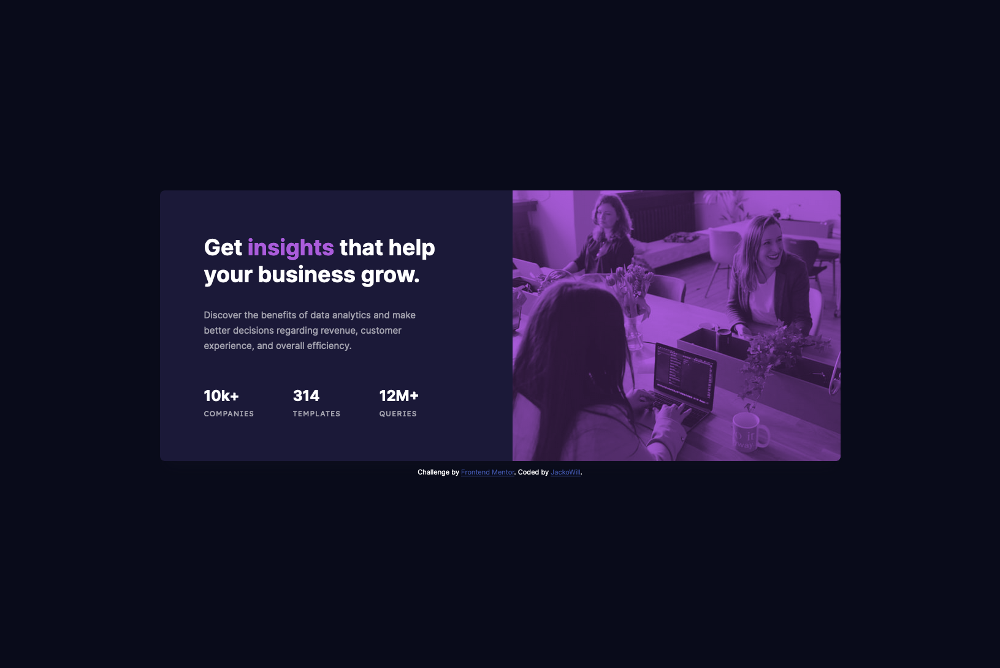

# Frontend Mentor - Stats preview card component solution

This is a solution to the [Stats preview card component challenge on Frontend Mentor](https://www.frontendmentor.io/challenges/stats-preview-card-component-8JqbgoU62). Frontend Mentor challenges help you improve your coding skills by building realistic projects.

## Table of contents

- [Overview](#overview)

  - [The challenge](#the-challenge)
  - [Screenshot](#screenshot)
  - [Links](#links)

  - [Built with](#built-with)
  - [What I learned](#what-i-learned)

- [Author](#author)

## Overview

Responsive Stats Preview Card Component

### The challenge

Users should be able to:

- View the optimal layout depending on their device's screen size

### Screenshot




### Links

- Solution URL: [Add solution URL here](https://your-solution-url.com)
- Live Site URL: [Add live site URL here](https://your-live-site-url.com)

### Built with

- Semantic HTML5 markup
- CSS custom properties
- Flexbox
- CSS Grid
- Mobile-first workflow

### What I learned

The biggest thing I learned in this challenge was how to change the color of the img provided. After some research, I found that all I had to do was store the image in a container and set a background color. Then adding mix-blend-mode: multiply to the image:

```css
.stats-card__img-container {
  /* change color of containers background */
  background-color: var(--clr-accent);
}
/* mix-blend-mode -- specifies how an elements content should blend with its direct parent background */
.stats-card__img-container img {
  mix-blend-mode: multiply;
}
```

Also, getting the height of the image to fit the container once I switched to the desktop view. Funny enough it was a very easy fix by just setting the height to 100% 😆

## Author

- Frontend Mentor - [@JackoWill](https://www.frontendmentor.io/profile/JackoWill)
